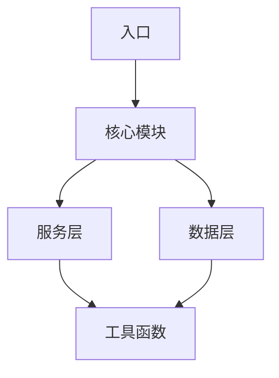

# Components Memory - 组件架构

> 此文件记录项目的组件架构和模块关系。

## 架构概览

```
┌─────────────────────────────────────────────────────────────┐
│                     项目架构 (待检测)                          │
│                                                              │
│   ┌─────────────┐   ┌─────────────┐   ┌─────────────┐       │
│   │   层级 1    │   │   层级 2    │   │   层级 3    │       │
│   └─────────────┘   └─────────────┘   └─────────────┘       │
│                                                              │
│   待 /stdd:init 检测项目结构后更新...                          │
│                                                              │
└─────────────────────────────────────────────────────────────┘
```

## 核心组件

### 待检测...

运行 `/stdd:init` 后将自动识别:
- [ ] 入口文件
- [ ] 核心模块
- [ ] 服务层
- [ ] 数据层
- [ ] 工具函数

## 模块依赖图



## 组件清单

| 组件 | 路径 | 职责 | 状态 |
|------|------|------|------|
| 待检测 | - | - | - |

## 接口契约

### 待检测...

## 更新记录

| 时间 | 更新内容 |
|------|----------|
| 2026-03-27 | 初始化创建 |

---

> 运行 `/stdd:init` 更新此文件
